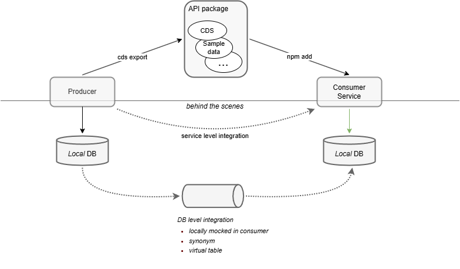

# AD161 - Integration of SAP Business Data Cloud with CAP and SAP Build

## Description

This repository contains the material for the SAP TechEd 2025 session called AD161 - Integration of SAP Business Data Cloud with CAP and SAP Build.  

## Names

In this document we use the following abbreviations:
* CAP for [SAP Cloud Application Model](https://cap.cloud.sap/docs/)
* HANA for [SAP HANA Cloud](https://www.sap.com/products/data-cloud/hana.html)
* BTP for [SAP Business Technology Platform](https://www.sap.com/products/technology-platform.html)
* BDC for[SAP Business Data Cloud](https://www.sap.com/products/data-cloud/hana.html)

## Overview

This session introduces attendees to Data Federation with CAP,
and in particular shows how to integrate a Data Product of BDC into a CAP application.

CAP Data Federation is about sharing data between two CAP apps or between a CAP and and another party.
We distinguish between what a developer needs to do in the model ("above the scenes") and the technical
connection. The latter should not be reflected in the model, but happens automatically in the background
("behind the scenes"), controlled by some configuration.

 

The picture shows Data Federation between two CAP apps, but the general pattern is similar for other use cases.
The producing app provides an interface to the data and publishes its definition. The consuming app imports
the interface definition and builds on top of it.

In the first part of this session, we build two CAP apps: _xflights_ is an app to that holds masterdata
for flights, airlines, ... and provides an API to access the data. _xtravels_ allows to book travels and flights
and makes use of the masterdata provided by _xflights_.

In the second part of the session, we extend the _xtravels_ app and also consume a BDC Data Product.

 

We focus on the CAP part of this integration. I.e. we assume that there already is a BDC tenant with
the required Data Product installed, and that we have access to that tenant.
In the HANA Cloud Instance we are using for the session, we have already created
a HANA Remote Source pointing to the BDC tenant, as well as a schema that contains virtual tables
pointing to the corresponding share tables in the BDC tenant. In the session, we will connect
the entities in the CAP app to these virtual tables, following the Data Federation pattern
established in the first part of the session.

## Requirements

The instructors will assign a user and a password to you. This will only be needed in exercise 4 to deploy to SAP HANA Cloud.
The user is of the form `capworkshopuser+0XX@gmail.com`, where XX is a unique number that is assigned to you.

## Exercises

The exercise is divided in five parts.
In the Getting Started section we prepare the _cds toolkit_ and set up the local workspace.
In exercise 1 we will create CAP app "xflights" that serves flight master data.
In exercise 2 we will create CAP app "xtravels" that consumes the masterdata from "xflights".
In exercise 3 we will import an S/4 Data Product to the "xtravels" app and run it locally in mock mode.
In exercise 4 we will deploy the database model of "xtravels" to a HANA Cloud, connect the Data
Product with a BDC tenant and run the app in hybrid mode.

- [Getting Started](exercises/ex0/)
- [Exercise 1 - Build CAP app xflights](exercises/ex1/)
    - [Exercise 1.1 - Create xflights project](exercises/ex1/README.md#exercise-11---create-xflights-project)
    - [Exercise 1.2 - Add the domain model](exercises/ex1/README.md#exercise-12---add-the-domain-model)
    - [Exercise 1.3 - Add OData service](exercises/ex1/README.md#exercise-13---add-odata-service)
    - [Exercise 1.4 - Add test data](exercises/ex1/README.md#exercise-14---add-test-data)
    - [Exercise 1.5 - Fiori preview](exercises/ex1/README.md#exercise-15---fiori-preview)
    - [Exercise 1.6 - Localized metadata](exercises/ex1/README.md#exercise-16---localized-metadata)
    - [Exercise 1.7 - Add API service](exercises/ex1/README.md#exercise-17---add-api-service)
    - [Exercise 1.8 - Export API service](exercises/ex1/README.md#exercise-18---export-api-service)
    - [Exercise 1.9 - Cleanup](exercises/ex1/README.md#exercise-19---cleanup)
- [Exercise 2 - Build CAP app xtravels](exercises/ex2/)
    - [Exercise 2.1 - Prepare](exercises/ex2/README.md#exercise-21---prepare)
    - [Exercise 2.2 - Import API package for flights](exercises/ex2/README.md#exercise-22---import-api-package-for-flights)
    - [Exercise 2.3 - Use the masterdata](exercises/ex2/README.md#exercise-23---use-the-masterdata)
    - [Exercise 2.4 - Inspect how the xflights data is used](exercises/ex2/README.md#exercise-24---inspect-how-the-xflights-masterdata-is-used)
    - [Exercise 2.5 - Run the XTravels app with flights being mocked](exercises/ex2/README.md#exercise-25---run-the-xtravels-app-with-flights-being-mocked)
    - [Exercise 2.6 - Get flights data from xflights app](exercises/ex2/README.md#exercise-26---get-flights-data-from-xflights-app)
    - [Exercise 2.7 - Cleanup](exercises/ex2/README.md#exercise-27---cleanup)
- [Exercise 3 - Consume S/4 Data Product Customer](exercises/ex3/)
    - [Exercise 3.1 - Discovery](exercises/ex3/README.md#exercise-31---discovery)
    - [Exercise 3.2 - Download Data Product metadata](exercises/ex3/README.md#exercise-32---download-data-product-metadata)
    - [Exercise 3.3 - Import Data Product metadata](exercises/ex3/README.md#exercise-33---import-data-product-metadata)
    - [Exercise 3.4 - Add consumption view](exercises/ex3/README.md#exercise-34---add-consumption-view)
    - [Exercise 3.5 - Use the Data Product in the model](exercises/ex3/README.md#exercise-35---use-the-data-product-in-the-model)
    - [Exercise 3.6 - Mock](exercises/ex3/README.md#exercise-36---mock)
    - [Exercise 3.7 - Cleanup](exercises/ex3/README.md#exercise-37---cleanup)
- [Exercise 4 - Deploy to SAP HANA Cloud](exercises/ex4/)
    - [Exercise 4.1 - Log on to Cloud Foundry](exercises/ex4/README.md#exercise-41---log-on-to-cloud-foundry)
    - [Exercise 4.2 - Deploy to SAP HANA Cloud](exercises/ex4/README.md#exercise-42---deploy-to-sap-hana-cloud)
    - [Exercise 4.3 - Run in hybrid mode](exercises/ex4/README.md#exercise-43---run-in-hybrid-mode)
    - [Exercise 4.4 - Create grantor service](exercises/ex4/README.md#exercise-44---create-grantor-service)
    - [Exercise 4.5 - (optional) Manually connect to BDC share](exercises/ex4/README.md#exercise-45---optional-manually-connect-to-bdc-share)
    - [Exercise 4.6 - Connect to BDC share](exercises/ex4/README.md#exercise-46---connect-to-bdc-share)

Start the exercises [here](exercises/ex0/).

**IMPORTANT**

Your repo must contain the .reuse and LICENSES folder and the License section below. DO NOT REMOVE the section or folders/files. Also, remove all unused template assets(images, folders, etc) from the exercises folder. 

## Contributing
Please read the [CONTRIBUTING.md](./CONTRIBUTING.md) to understand the contribution guidelines.

## Code of Conduct
Please read the [SAP Open Source Code of Conduct](https://github.com/SAP-samples/.github/blob/main/CODE_OF_CONDUCT.md).

## How to obtain support

Support for the content in this repository is available during the actual time of the online session for which this content has been designed. Otherwise, you may request support via the [Issues](../../issues) tab.

## License
Copyright (c) 2024 SAP SE or an SAP affiliate company. All rights reserved. This project is licensed under the Apache Software License, version 2.0 except as noted otherwise in the [LICENSE](LICENSES/Apache-2.0.txt) file.
